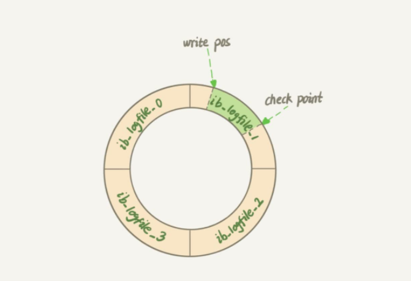

# 一条更新SQL如何执行
## 前言
前面我们系统了解了一个查询语句的执行流程，那么一条更新语句又是怎样的呢？
与查询流程不一样的是，更新流程还涉及两个重要的日志模块，它们正是我们今天要讨论的 主角：redo log （重做日志）和 binlog（归档日志）。

## 1、Redo Log
- 如果每一次的更新操作都需要写进磁盘，然后磁盘也要找到对应的那条记录，然后再更新，整个过程`IO`成本、查找成本都很高。 
为了解决这个问题，MySQL的设计者就用了类似酒店掌柜粉板的思路来提升更新效率。

- 粉板和账本配合的整个过程，其实就是 MySQL 里经常说到的`WAL`技术，WAL的全称是Write-Ahead Logging ， 
它的关键点就是先写日志，再写磁盘，也就是先写粉板，等不忙的时候再写账本。
具体来说，当有一条记录需要更新的时候，InnoDB 引擎就会先把记录写到 redo log（粉 板）里面，并更新内存，这个时候更新就算完成了。
同时，InnoDB 引擎会在适当的时候， 将这个操作记录更新到磁盘里面
 
- InnoDB 的 redo log 是固定大小的， 比如可以配置为一组 4 个文件，每个文件 的大小是 1GB，那么这块 “粉板”
总共就可以记录 4GB 的操作。 从头开始写，写到末尾就 又回到开头循环写，如下面这个图所示。

- 有了redo log，InnoDB 就可以保证即使数据库发生异常重启，之前提交的记录都不会丢失，这个能力称为 crash-safe

## 2、Bin log
上面我们聊到的 粉板 redo log 是 InnoDB 引擎特有的日志， 而 Server 层也有自己的日志，称为 binlog （归档日志）

### 2.1 两种日志比较
1.redo log 是InnoDB引擎特有的 ； binlog 是 MySQL 的 Server 层实现的 ，所有引擎都 可以使用。
2. redo log 是物理日志，记录的是“在某个数据页上做了什么修改”；binlog 是逻辑日志，记录的是这个语句的原始逻辑，比如“给 ID=2 这一行的 c 字段加 1 ”
3.redo log 是循环写的，空间固定会用完会覆盖写；binlog 是可以追加写入的。“追加写”是指binlog 文件写到一定大小后会切换到下一个，并不会覆盖以前的日志。

### 2.2 update SQL执行过程
'''
update T set c=c+1 where ID=2
'''
1.执行器先找引擎取 ID=2 这一行。ID是主键，引擎直接用树搜索找到这一行。读入内存，然后再返回。
2.执行器拿到引擎给的行数据，把这个值加上 1，比如原来是 N，现在就是 N+1 ， 得到新
的一行数据，再调用引擎接口写入这行新数据。
3.引擎将这行新数据更新到内存中，同时将这个更新操作记录到 redo log 里面，此时 redo log 处于 prepare 状态。
4.执行器生成这个操作的 binlog，并把 binlog 写入磁盘。
5.执行器调用引擎的提交事务接口，引擎把刚刚写入的 redo log 改成提交（commit）状 态，更新完成。

