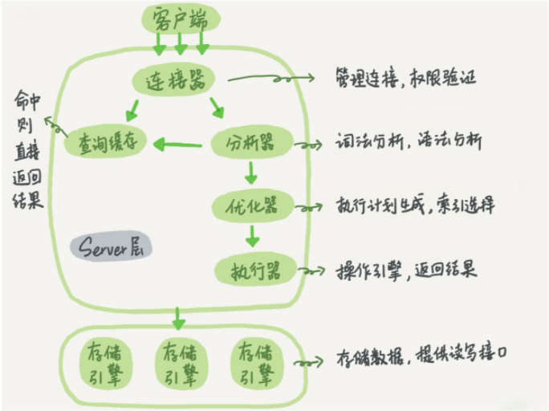

# 一条查询SQL如何执行
## 前言
在执行一条查询语句时，我们看到的只是输入一条语句，返回一个结果，却不知道这条语句在 MySQL 内部的执行过程。
所以今天我想和你一起把 MySQL 拆解一下，看看里面都有哪些 “零件” ， 希望借由这个 拆解过程，让你对 MySQL 有更深入的理解。

下面我给出的是 MySQL 的基本架构示意图，从中你可以清楚地看到 SQL 语句在 MySQL的各个功能模块中的执行过程。

- 大体来说，MySQL 可以分为 Server 层和存储引擎层两部分。
Server 层包括连接器、 查询缓存、 分析器、 优化器、 执行器等，涵盖 MySQL 的大多数核 心服务功能，
所有跨存储引擎 的功能都在这一层实现，比如存储过程、触发器、视图等。

- 存储引擎层负责数据的存储和提取。 其架构模式是插件式的，支持 InnoDB、 MyISAM、 Memory 等多个存储引擎。