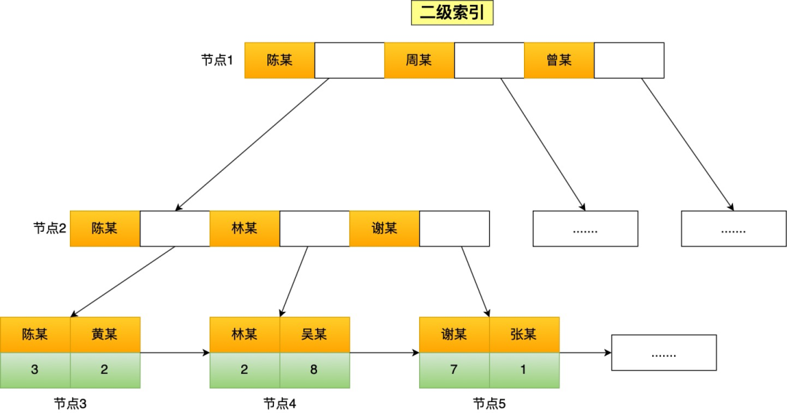
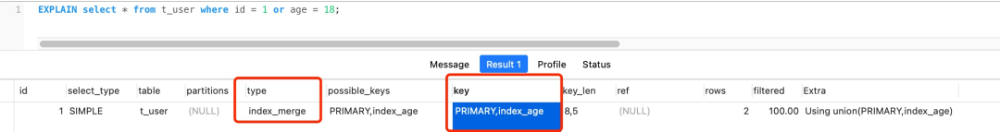

# 第一节：索引什么情况下会失效

## 一、前言
   在工作中，如果我们想提高一条语句查询速度，通常都会想对字段建立索引,但是索引并不是万能的。建立了索引，并不意味着任何查询语句都能走索引扫描。
稍不注意，可能你写的查询语句是会导致索引失效，从而走了全表扫描，虽然查询的结果没问题，但是查询的性能大大降低。
今天就来跟大家盘一盘，常见的 6 种会发生索引失效的场景.

## 索引存储结构长什么样
我们先来看看索引存储结构长什么样？因为只有知道索引的存储结构，才能更好的理解索引失效的问题
索引的存储结构跟MySQL使用哪种存储引擎有关，因为存储引擎就是负责将数据持久化在磁盘中，而不同的存储引擎采用的索引数据结构也会不相同
- ** InnoDB 存储引擎：B+ 树索引的叶子节点保存数据本身**
- ** MyISAM 存储引擎：B+ 树索引的叶子节点保存数据的物理地址**

查询条件用上了索引列，并不一定查询过程就一定都用上索引，接下来我们再一起看看哪些情况会导致索引实现，而发生全表扫描

### 对索引使用左或者左右模糊匹配
当我们使用左或者左右模糊匹配的时候，也就是 like %xx 或者 like %xx% 这两种方式都会造成索引失效

** 为什么 like 关键字左或者左右模糊匹配无法走索引呢？**
因为索引 B+ 树是按照「索引值」有序排列存储的，只能根据前缀进行比较

### 对索引使用函数
有时候我们会用一些 MySQL 自带的函数来得到我们想要的结果，这时候要注意了，如果查询条件中对索引字段使用函数，就会导致索引失效
** 为什么对索引使用函数，就无法走索引了呢？**
因为索引保存的是索引字段的原始值，而不是经过函数计算后的值，自然就没办法走索引了

### 对索引进行表达式计算
在查询条件中对索引进行表达式计算，也是无法走索引的，如：select * from t_user where id + 1 = 10
原因跟对索引使用函数差不多

### 对索引隐式类型转换
隐式类型转换是通过 CAST 函数实现的，等同于对索引列使用了函数，所以就会导致索引失效

### 联合索引非最左匹配
联合索引要能正确使用需要遵循最左匹配原则，也就是按照最左优先的方式进行索引的匹配，
如果我们想使用联合索引中尽可能多的列，查询条件中的各个列必须是联合索引中从最左边开始连续的列。如果我们仅仅按照第二列搜索，肯定无法走索引

### WHERE 子句中的 OR
在 WHERE 子句中，如果在 OR 前的条件列是索引列，而在 OR 后的条件列不是索引列，那么索引会失效

可以看到 type=index merge， index merge 的意思就是对 id 和 age 分别进行了扫描，然后将这两个结果集进行了合并，
这样做的好处就是避免了全表扫描